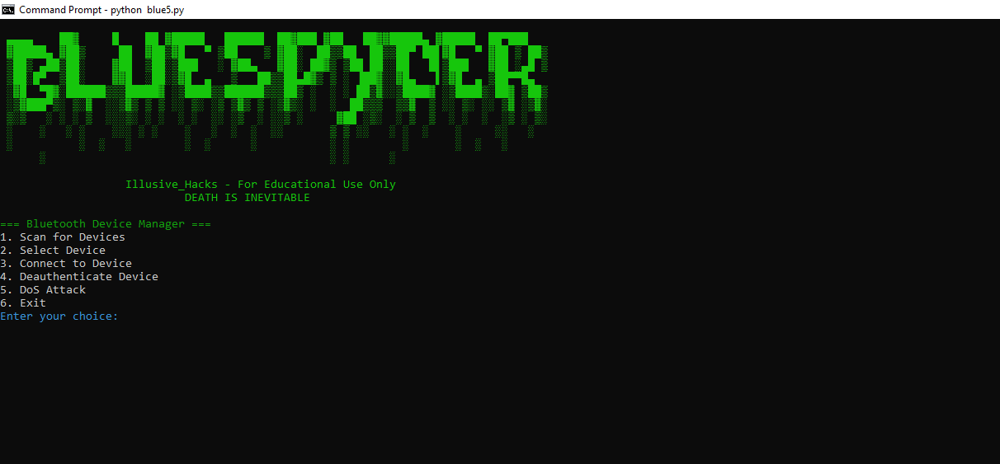

# bluespyder

#Under development and research

Bluetooth Device Manager 🌐

Welcome to the Bluetooth Device Manager, a sleek and powerful tool designed for managing and interacting with Bluetooth devices. This script is crafted with precision, combining functionality with an aesthetic appeal, making it both practical and visually engaging.

🌟 Features

Device Scanning: Discover nearby Bluetooth devices with ease.

Device Selection: Choose a device from the list of discovered devices.

Device Connection: Connect to a selected Bluetooth device.

Deauthentication: Deauthenticate a connected Bluetooth device.

DoS Attack: Launch a Denial-of-Service (DoS) attack on a target device.

Logging: All actions are logged for future reference.

Aesthetic Interface: Enjoy a visually pleasing terminal interface with color-coded outputs.

🛠️ Usage

Scan for Devices: Use the Scan for Devices option to discover nearby Bluetooth devices.

Select Device: Choose a device from the list of discovered devices.

Connect to Device: Connect to the selected device.

Deauthenticate Device: Deauthenticate the connected device.

DoS Attack: Launch a DoS attack on the selected device.

Exit: Exit the program.

⚠️ Disclaimer

This tool is intended for educational purposes only. Use it responsibly and only on devices you own or have permission to interact with. The authors are not responsible for any misuse of this tool.

📜 Code Overview

The script is structured into several functions, each handling a specific task:

display_banner(): Displays the ASCII banner.

clear_terminal(): Clears the terminal screen.

load_config(): Loads configuration from a JSON file.

save_config(): Saves configuration to a JSON file.

scan_devices(): Scans for nearby Bluetooth devices.

select_device(): Selects a device from the list of discovered devices.

connect_to_device(): Connects to the selected Bluetooth device.

deauthenticate_device(): Deauthenticates a Bluetooth device.

dos_attack(): Launches a DoS attack on a target Bluetooth device.

display_menu(): Displays the main menu.

main(): The main program loop.

🚀 Getting Started

To get started, simply run the script in your terminal:

bash

python blue5.py

📝 Logging

All actions are logged to bluetooth_manager.log for future reference. This includes device discovery, connection attempts, deauthentication, and DoS attacks.

🎨 Aesthetic Elements

The script uses Colorama to add color to the terminal output, making it more visually appealing and easier to read. The ASCII banner is designed to give the tool a unique and professional look.

📌 Notes

Ensure you have the necessary permissions to interact with Bluetooth devices on your system.

The script uses Bleak for Bluetooth communication, which is a powerful library for handling Bluetooth Low Energy (BLE) devices.

🌐 Connect

For more tools and projects, visit Illusive_Hacks.

Enjoy using the BlueSpyder! Remember, with great power comes great responsibility. Use this tool wisely and ethically.

DEATH IS INEVITABLE

Illusive_Hacks - For Educational Use Only

